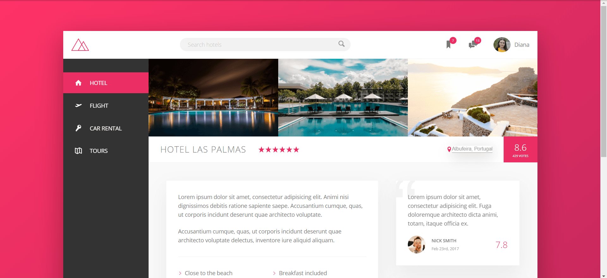
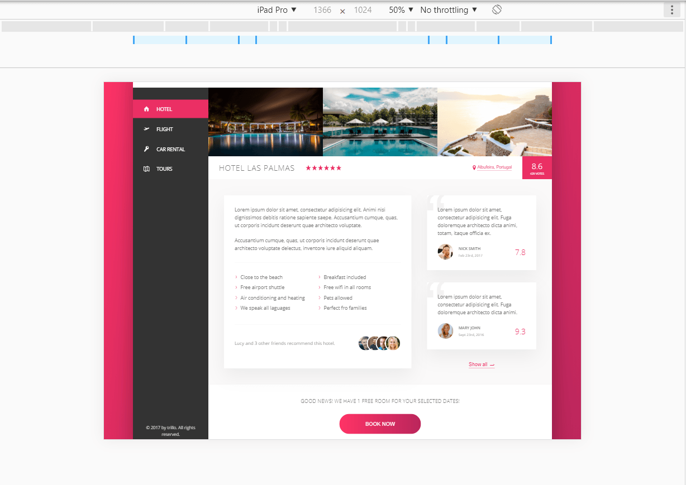

# Front-end__flexbox-layout
### This is one of my projects made following an advanced css and sass course. Here are some photos:



### The project contains 3 main sections: 
* header
* sidebar
* hotelview
  * gallery
  * overview
  * detail
  * cta


### Main notions that I've learned after this course:
* flexbox properties
  * container
     ###### ``` flex-direction: row | row-reverse | column | column-reverse ```
     ###### ``` flex-wrap: nowrow | wrap | wrap-reverse ```
     ###### ``` justify-content: flex-start | flex-end | center | space-between | space-around | space-evenly ```
     ###### ``` align-items: stretch | flex-start | flex-end | center | baseline ```
     ###### ``` align-content: stretch | flex-start | flex-end | center | space-between | space-around ```
  * item
    ###### ``` align-self: auto | stretch | flex-start | flex-end | center | baseline ```
    ###### ``` order: 0 | <integer> ```
    ###### ``` flex-grow: 0 | <integer> ```
    ###### ``` flex-shrink: 1 | <integer> ```
    ###### ``` flex-basis: auto | <length>```
    ###### ``` flex: 0 1 auto | <int> <int> <len> (this property is actually the short version of the last 3 properties: grow-shrink-basis)```
     
* how to use svg icons
* create animations, multiple transitions properties
* how to use ``` mask-size  ``` and ``` mask-image  ```

### :exclamation: If you run the index file the svg icons will dissapear, you have to run the browser with security disabled. For example on chrome: https://stackoverflow.com/questions/3102819/disable-same-origin-policy-in-chrome
